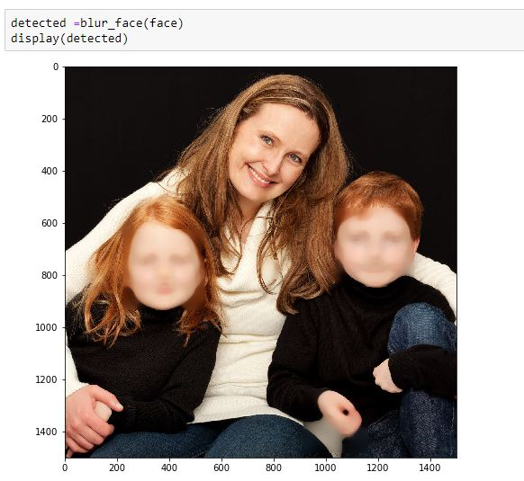

# Age_Classifer_UTKFace
Convolutional Neural Network classifier for identifying age of persons face trained us using  UTKFace image dataset.

# Download Imagery
The UTKFace dat set can be downloaded [here.](https://susanqq.github.io/UTKFace/)

# Repository Content
This repsoitory contains a number of notebooks for creating CNN models using facial imagery data and
Methods of improving the accuracy of the models using Hyperparameter tuning and Sampling techniques to deal with the imbalance in classes. It also contains an openCV script to detect faces in an image and identify the age of the faces.

### Children Face blur

